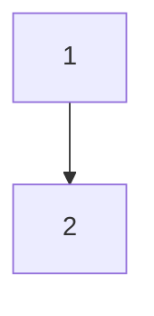

- 初版 : 2025-03-26

レポートを書く時のためのテンプレートファイル

1. 執筆準備
    - このファイルをコピーする
    - ファイル名を適切なものに変更する
      - 2099-12-31-template.md : 日付プレフィックス + タイトル
      - ファイル名に **日本語を使わない**
      - 日付プレフィックスは初版公開日（or執筆日）のものにする
      - 更新があった場合、ドキュメント内にその旨を記載する。日付プレフィックスは変更しない
    - 複数ファイル (画像や markdown) を含めたい場合
      - 2099-12-31-template/index.md のようにフォルダーを作る
      - このファイルは index.md として扱う
      - markdown 間の並び順が気に入らない場合はファイル名で制御する
2. 書く
3. 公開準備
    - ファイル先頭の frontmatter を編集する
    - draft: true を **消さないと** 公開されない

## 使える記法

mermaid は書けます。



syntax highlighting もできます。

```js title="sample/dir/file.js"
function HelloCodeTitle(props) {
  return <h1>Hello, {props.name}</h1>;
}
```

## 子ファイル

レポート内に画像を含めたい、あるいは補足資料となるドキュメントを添付したい場合、以下のように書くことができます。

```md
[sub document 01](./subdocument01.md)

[image](./image/image01.png)
```

ただし、子ファイルを持つ場合はディレクトリ構造を作ってその中に置くようにしてください。

- reports/
  - 2025-01-01-simple-report.md
  - **2025-01-02-multifile-report/**
    - index.md
    - subdocument01.md
    - image/
      - image01.png

## heading level 2 から書き始める

YAML frontmatter に title がある場合はそれが heading level 1 として扱われるので、コンテンツは heading level 2 以降を使うべきです。

```md
---
title: レポートタイトル
tags: []
---

## section の開始
```

ただし、YAML frontmatter の title は必須ではありません。以下は許容されます。

```md
---
tags: []
---

# レポートタイトル

## section の開始
```

同様に YAML frontmatter も必須ではありません。以下も許容されます。

```md
# レポートタイトル

## section の開始
```
